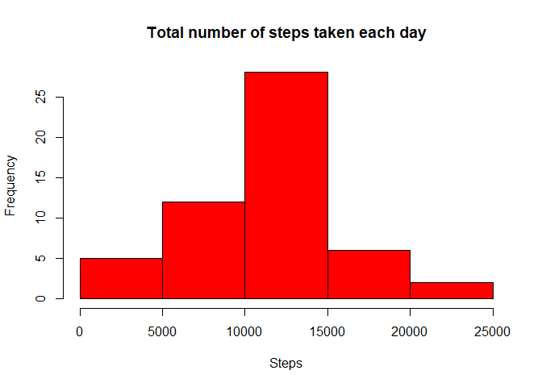
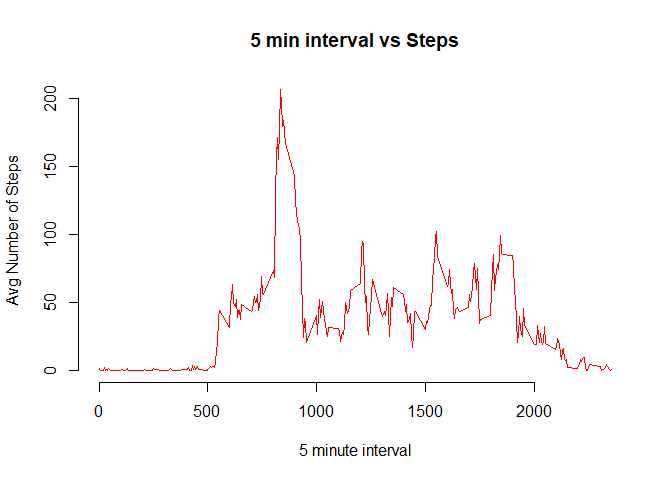
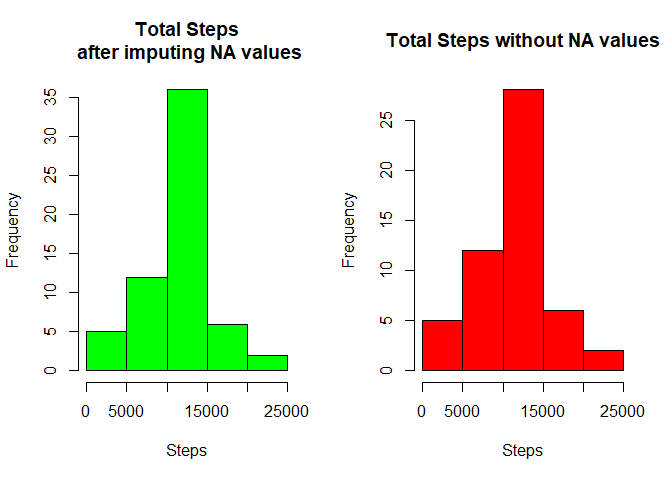
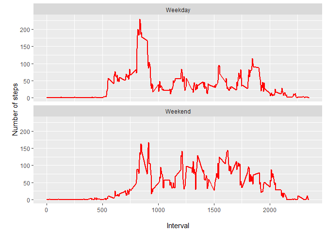

## Loading and preprocessing the data

```r
library(dplyr)
```

```
## 
## Attaching package: 'dplyr'
```

```
## The following objects are masked from 'package:stats':
## 
##     filter, lag
```

```
## The following objects are masked from 'package:base':
## 
##     intersect, setdiff, setequal, union
```

```r
library(ggplot2)

#Load data
activity_data_raw=read.csv("./repdata_data_activity/activity.csv")
#Transforming data to suitable format
activity_data=activity_data_raw[complete.cases(activity_data_raw), ]
activity_data$date=as.Date(activity_data$date)
```
## What is mean total number of steps taken per day?

```r
#Calculate total steps taken per day
total_steps_day=aggregate(activity_data["steps"], by=activity_data["date"], sum)
#Build histogram of total steps taken per day
hist(total_steps_day$steps,main = "Total number of steps taken each day",xlab ="Steps",col="red")
```

<!-- -->

```r
#Calculating mean and median of total steps taken per day
mean_steps=as.character(round(mean(total_steps_day$steps),2))
median_steps=as.character(round(median(total_steps_day$steps),2))
```
**Mean** number of steps taken per day: 10766.19
**Median** number of steps taken per day: 10765

## What is the average daily activity pattern?

```r
#Calculating average steps per 5 minute interval
daily_pattern=aggregate(activity_data["steps"], by=activity_data["interval"], mean)
#Plot average steps vs 5 minute interval 
plot(daily_pattern$interval,daily_pattern$steps,frame = FALSE, type="l",pch = 19,col = "red", xlab = "5 minute interval", ylab = "Avg Number of Steps",main = "5 min interval vs Steps")
```

<!-- -->

```r
#Calculating interval with maximum number of steps
interval=daily_pattern[daily_pattern$steps==max(daily_pattern$steps),]$interval
```
**Interval** with maximum number of steps : 835

## Imputing missing values

```r
#Count number of missing values
count_missing=nrow(activity_data_raw[!complete.cases(activity_data_raw), ])
```
**NA values** count : 2304

```r
#Merge Activity data with the 5 minute interval averages
missing_data=merge(activity_data_raw,daily_pattern,by="interval")
#Filling NA values with avg of the 5 minute interval
missing_data$steps=ifelse(is.na(missing_data$steps.x),missing_data$steps.y,missing_data$steps.x)
#New Data set with all NA values filled
missing_data=missing_data[,c("interval","date","steps")]
head(missing_data,5)
```

```
##   interval       date    steps
## 1        0 2012-10-01 1.716981
## 2        0 2012-11-23 0.000000
## 3        0 2012-10-28 0.000000
## 4        0 2012-11-06 0.000000
## 5        0 2012-11-24 0.000000
```

```r
#Panel with 2 colomns
par(mfrow=c(1,2))
#Calculate sum of steps taken per day after imputing NA values
missing_data_plot=aggregate(missing_data["steps"], by=missing_data["date"], sum)
#Histogram before and after imputing NA values to show impact 
hist(missing_data_plot$steps,main = "Total Steps\n after imputing NA values",xlab ="Steps",col="green")
hist(total_steps_day$steps,main = "Total Steps without NA values",xlab ="Steps",col="red")
```

<!-- -->

```r
mean_steps_new=as.character(round(mean(missing_data_plot$steps),2))
median_steps_new=as.character(round(median(missing_data_plot$steps),2))
```
***Before NA Imputing:***
Mean:10766.19
Median:10765
***After NA Imputing:***
Mean:10766.19
Median:10766.19

No Significant change in mean has been observed.

## Are there differences in activity patterns between weekdays and weekends?

```r
par(mfrow=c(1,1))
#Finding day from the date
missing_data$Day=weekdays(as.Date(missing_data$date))
missing_data$Factor="None"
# Find Saturday and Sunday and mark as Weekend and others as Weekday
missing_data[grepl("S(at|un)",missing_data$Day),]$Factor="Weekend"
missing_data[!grepl("S(at|un)",missing_data$Day),]$Factor="Weekday"
#Conver to Factor
missing_data$Factor=as.factor(missing_data$Factor)
#Calculating average number of steps taken in 5 minute intervals for weekends and weekdays
weekend_data=aggregate(missing_data["steps"], by=missing_data[c("interval","Factor")], mean)
#Plot graph for weekend and weekday number of steps taken
ggplot(weekend_data, aes(x=interval, y=steps)) + geom_line(color="red", size=1) + facet_wrap(~Factor, nrow=2) +labs(x="\nInterval", y="\nNumber of steps")
```

<!-- -->
